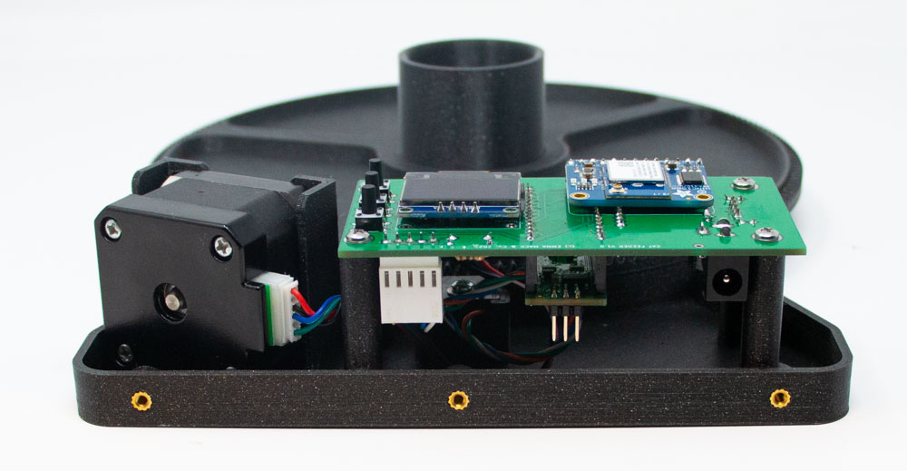

# Cat Feeder
Firmware for an automatic cat feeder. 

### Setup
This program runs on an Arduino Nano, on Emma Mack & Co.'s CAT FEEDER V1.0 board. Required nonstandard libraries, which can be installed through the Arduino IDE, are: 
* Adafruit_GFX
* Adafruit_SSD1306
* FlexyStepper
